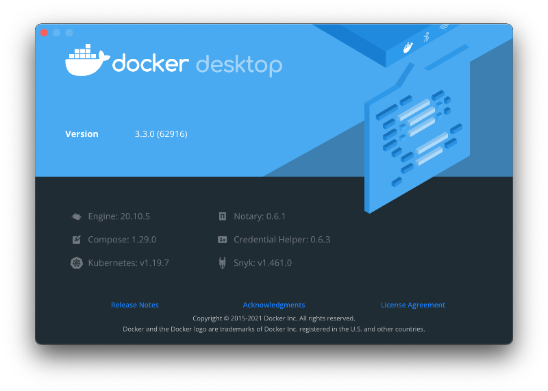
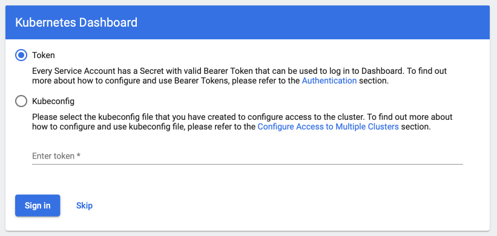
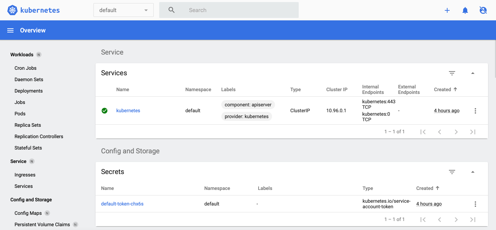
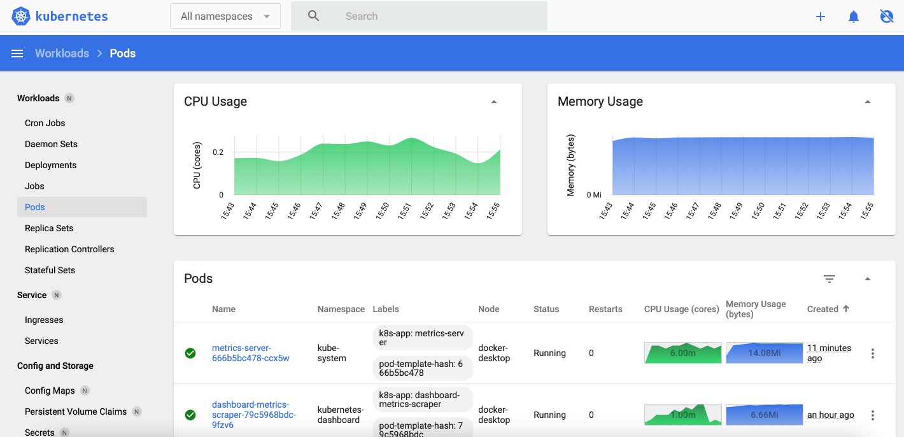
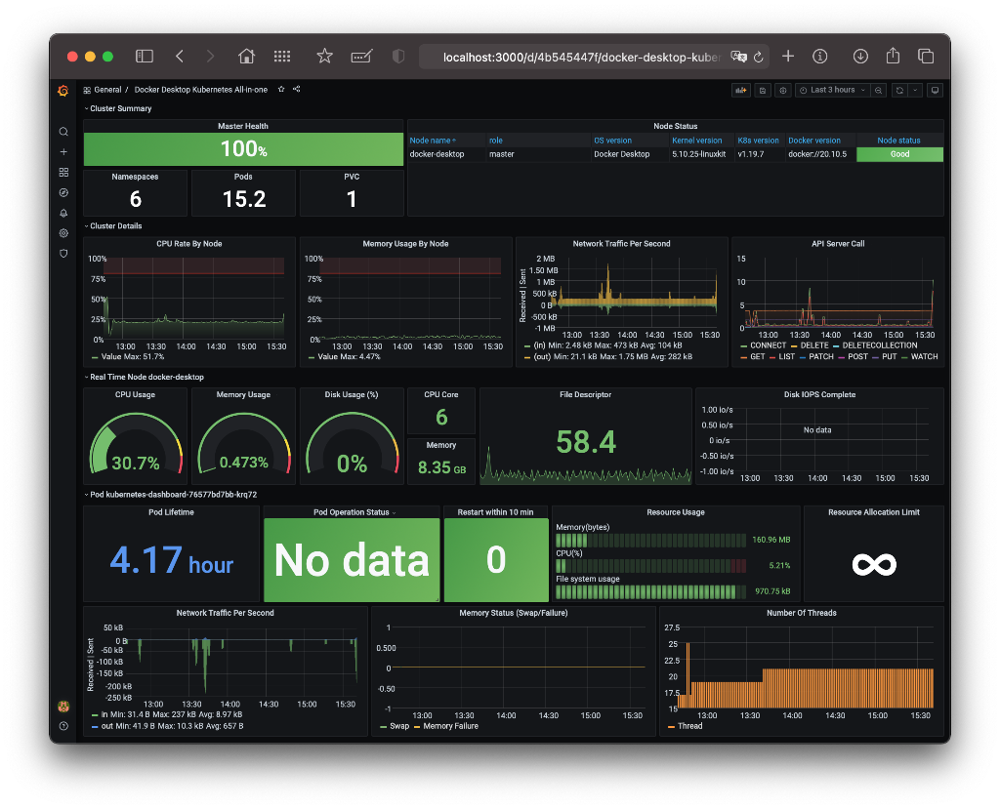

# Locally install Kubernetes with essential components

> 
> This procedure is working on macOS indeed - and it's a great deal. Hope this work on others systems with some 
> modification, but I can't guarantee.

>
> I kept all YAML configuration files in the [k8s](k8s) directory. I will specify where they come from and
> what modification has been included when necessary.


## Kubernetes

* I'm using `Docker for Desktop` which you can find obviously at https://www.docker.com/products/docker-desktop

  

* After installation, you can grapple basic information from your cluster:

```shell
% kubectl cluster-info
```
```shell
% kubectl get ns
``` 

- Or even:
  
```shell
% kubectl get all -A
```
> **Note the `-A`**
> 
> Since Kube `1.14`, we don't have to use the `--all-namespaces` anymore! So don't...


## Kubernetes Dashboard

`Dashboard` is a web UI of k8s API and provide an easy way to visualize and debug things:
  https://github.com/kubernetes/dashboard
  

### Installation

By default, `Dashboard` is protected by a token, and each time you'll access it, you'll be asked to provide one. It could 
really be annoying in the long run. Fortunately, `Kubernetes Dashboard` allows you to bypass the login page by adding `--enable-skip-login` to the 
configuration.

> The repository configuration file is patched with this instruction (line 198) 

> Obviously this is only for local platform!

To deploy `Dashboard` - with no authentication - execute the following command:
```
% kubectl apply -f ./k8s/dashboard-v2.2.0-recommended.yaml
```
Then access your dashboard from your local workstation by creating a secure channel to your Kubernetes cluster. To do 
so, run the following command:
```
% kubectl proxy
```
The address is now:

http://localhost:8001/api/v1/namespaces/kubernetes-dashboard/services/https:kubernetes-dashboard:/proxy/

> Don't forget to bookmark the URL!

You'll see this login page at first:



Just push the `skip` button to bypass authentication.



## Metrics-Server

`Metrics-Server` is used to crop metrics from k8s components and expose them to k8s API:
  https://github.com/kubernetes-sigs/metrics-server

`Metrics Server` serves the goals of core metrics pipelines: CPU and RAM. It's a cluster level component which 
periodically scrapes metrics from all Kubernetes nodes served by Kubelet. When installed, Kubernetes Dashboard displays
this metrics.

To allow `Metrics Server` to collect its data over https, the original script has been modified to accept insecure TLS
connections by adding `- --kubelet-insecure-tls` at line 133.

> Once again, don't do this on your public servers!

Apply the configuration by entering :
```
% kubectl apply -f k8s/metrics-server-components-v0.4.2.yaml
```

When reloading the Dashboard, you should now see CPU and Memory Usages 🌈

You can try the `Pods` section, that's my favorite! 



## Kube State Metrics

Unlike Metrics Server, `Kube State Metrics` is focused on generating numerous metrics from Kubernetes' object state 
(e.g. metrics based on deployments, replica sets, pods, etc.). It holds an entire snapshot of Kubernetes state in memory
and generates new metrics based off of it.

Having `Kube State Metrics` enables access to these metrics from monitoring systems such as `Prometheus`.

To install Kube State Metrics, launch the following:
```
% kubectl apply -f k8s/kube-state-metrics-v2.0.0-rc.1.yaml
```

## Prometheus

As specified in the documentation, *Metrics Server* is useful for:

- CPU/Memory based horizontal autoscaling
- Automatically adjusting/suggesting resources needed by containers

But when its comes to:

- Have an accurate source of resource usage metrics
- Manage Horizontal autoscaling based on other resources than CPU/Memory

You should check out full monitoring solutions like `Prometheus` 
[https://prometheus.io](https://prometheus.io).

In a few words, `Prometheus` is a monitoring and alerting system which:
- Collects data identified by a metric name
- Stores time-series in memory and on local disk for efficiency
- Allows notifications and alerting depending on data queries

### Installation

Prometheus' maintainers provide binaries and Docker images for `Prometheus` components. 
With a bit of elbow grease, it is possible to create a k8s configuration file with everything we need:
- Access to resources we want to monitor at cluster level
- Role dedicated to Prometheus
- Prometheus executable configuration
- Docker image deployment
- Exposition through service
- And some specific paths due to Docker Desktop for Mac! 🥵

To run the `Prometheus` configuration, run the command:
```
% kubectl apply -f k8s/prometheus.yaml
```

You can now access `Prometheus` interface at:
[http://localhost:30000/](http://localhost:30000/)... but wait and see!!

## Grafana

`Grafana` [https://grafana.com/grafana/](https://grafana.com/grafana/) allows you to « *query, visualize and alert on 
metrics through a powerful user interface* » as the site puts.

In practice, you will develop your query in `Prometheus`, and when you're satisfied with, run on `Grafana` to 
monitor your service.

As you can see, the `Grafana` graphical interface offers numerous possibilities:



To install Grafana, run the command:
```
% kubectl apply -f k8s/grafana-datasource.yaml
% kubectl apply -f k8s/grafana.yaml
```

Grafana will be listening on [http://localhost:3000](http://localhost:3000). The default login is "admin" / "admin".

> Note:
> 
> Configuring a dashboard in Grafana could be long, costly, and time-consuming. Collecting metrics depends on your host, 
VM/Virtualization Framework and the OS on your pod.

You own a Mac, you're running Docker Desktop and have followed this guide : you can import this 
[dashboard](./k8s/Docker Desktop Kubernetes All-in-one-1618321310777.json) right now to start monitoring your K8S cluster!